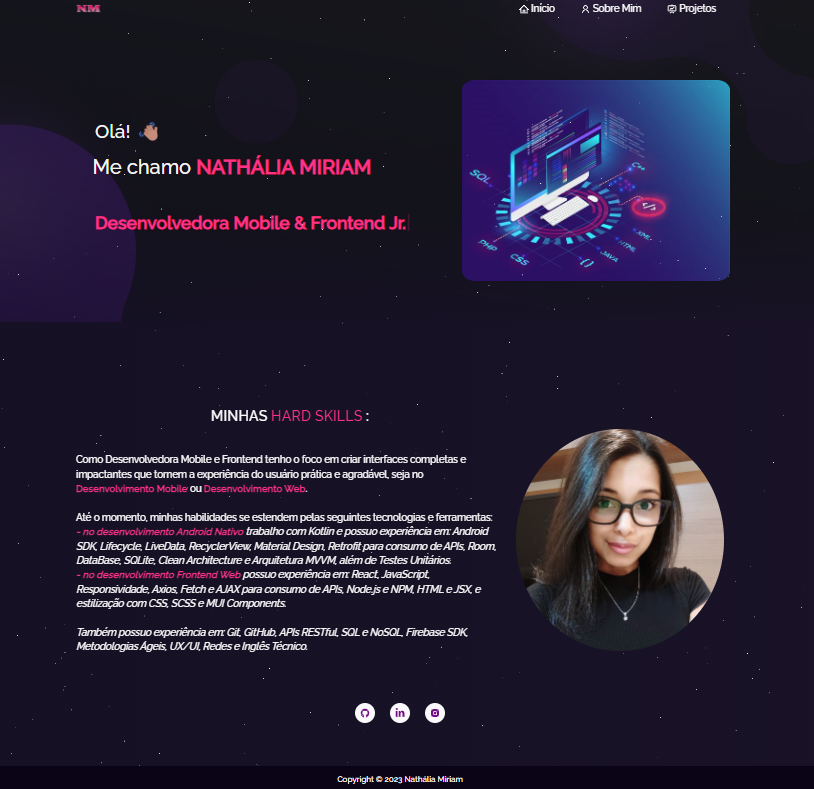
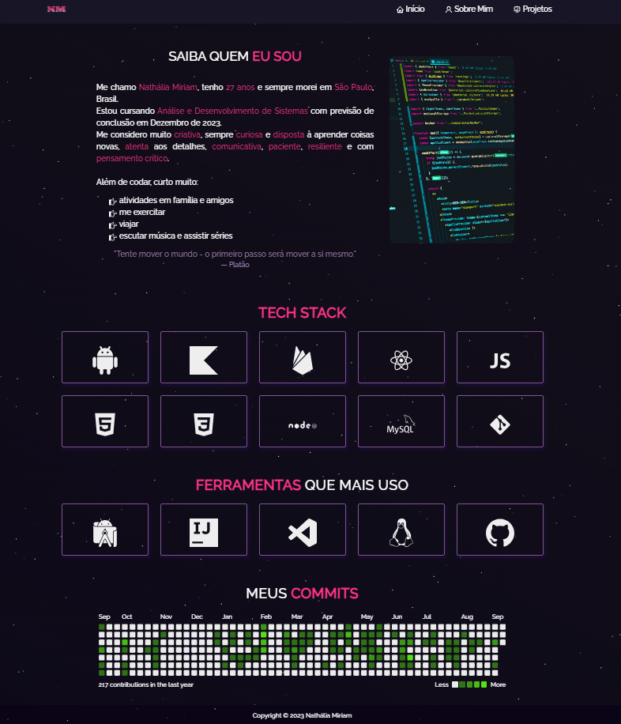
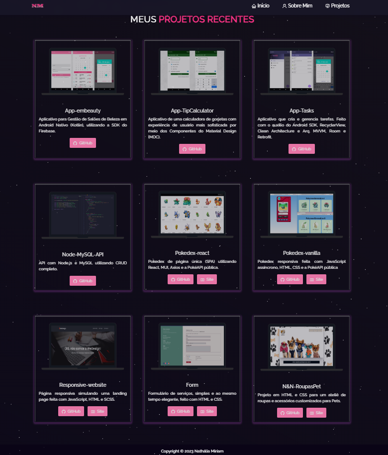
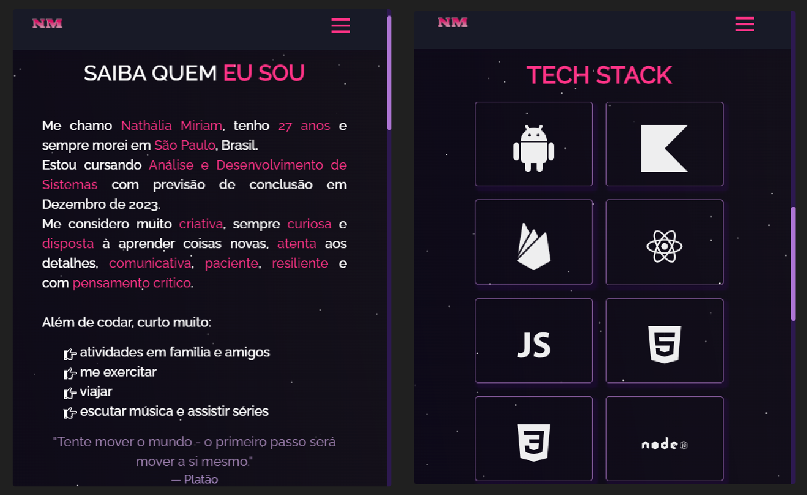

## Portfólio - Nathália Miriam

### 📄 Descrição:

Portfólio responsivo de 3 páginas feito com React e Bootstrap.

##

### 💻 Layout:

- primeira página -> falo sobre as minhas hard skills e deixo os links para que me encontrem em outras redes:
<h1>
  
</h1>
 

- segunda página -> falo um pouco sobre mim e minhas soft skills, mostro as técnologias e ferramentas que mais tenho usado no momento e o quadro dos meus commits:
<h1>
  
</h1>
 

- terceira página -> mostro alguns dos meus projetos recentes:
<h1>
  
</h1>
 

- layout do portfólio em um dispositivo móvel:
<h1>
  
</h1>

### 📍 Autora:

- NATHÁLIA MIRIAM
- LinkedIn: https://www.linkedin.com/in/nathaliamiriam/
- Portfólio: https://nathaliamiriam.github.io/
